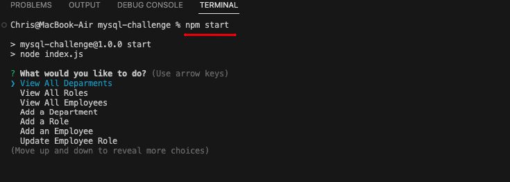
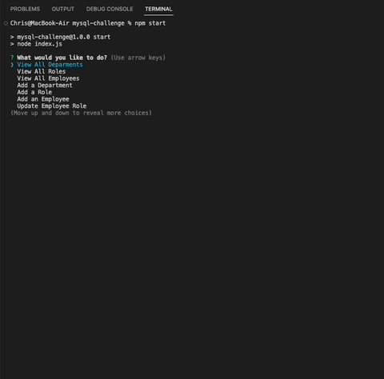
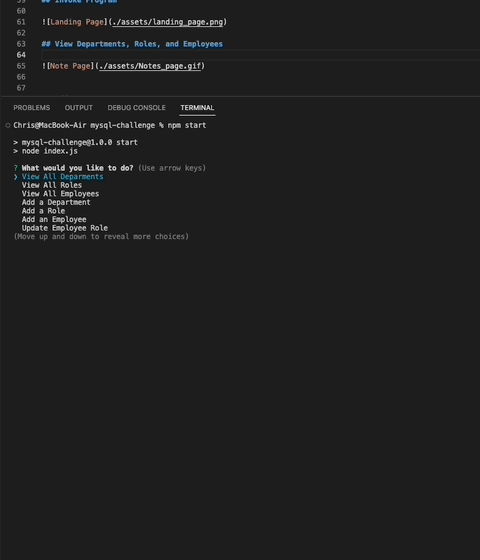
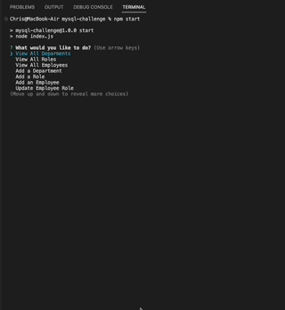
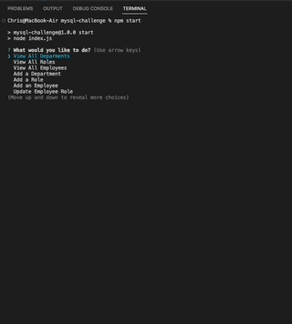

# Staff Mapper

Link to Github Repo: 
```
https://github.com/chrisgom113/Staff-Mapper
```
Walkthru Video link:
``` 
TODO
```

# Description

This app uses employs MySql2 in order to implement database features of coding. In addition the task calls for the use of Inquirer for command line prompting as well as console.table for a more user-friendly visual rendition of the data arrays.

The idea is to allow for a user to use command line prompting to view an employee database with specific details about the employee roles, names, departments, managers, and salaries. The featured database code also links relational data in order to link data together that may be originally stored in a separate table (per schema code). Aside from being able to survey the information, the user also has the ability to add new roles, add employees, and to further update employee information.

Ideal for a manager or company owner, this app is helpful in keeping track of staff, and modifying the staff data as needed.

See below for user story for context:

## User Story:

```
AS A business owner
I WANT to be able to view and manage the departments, roles, and employees in my company
SO THAT I can organize and plan my business
```


# Installation


Uses

```
Node.js

NPM
 
```
Use 'npm i' to download the dependencies listed below:
```
MySQL
Inquirer.js
console.table
```


# Usage

- User can invoke the program by typing "npm start". This beings the command line prompts.
- User is presented with a list of choices including viewing certain database components, as well as add or updating database components.
- Upon making a selection to view a database component, user is presented with a table that depicts data based on the user's selection.
- Upon making a selection to add or update a database component, user is presented with one or more additional command prompts to clarify certain data elements.
- User can return to the database table to view that their change has been made or updated.
- Once finished, user can select "Quit" to end the program.

## Invoke Program


  
## View Departments, Roles, and Employees




## Add a Department



## Add a Role



## Add an Employee



## Update an Employee Role


 
# License

None